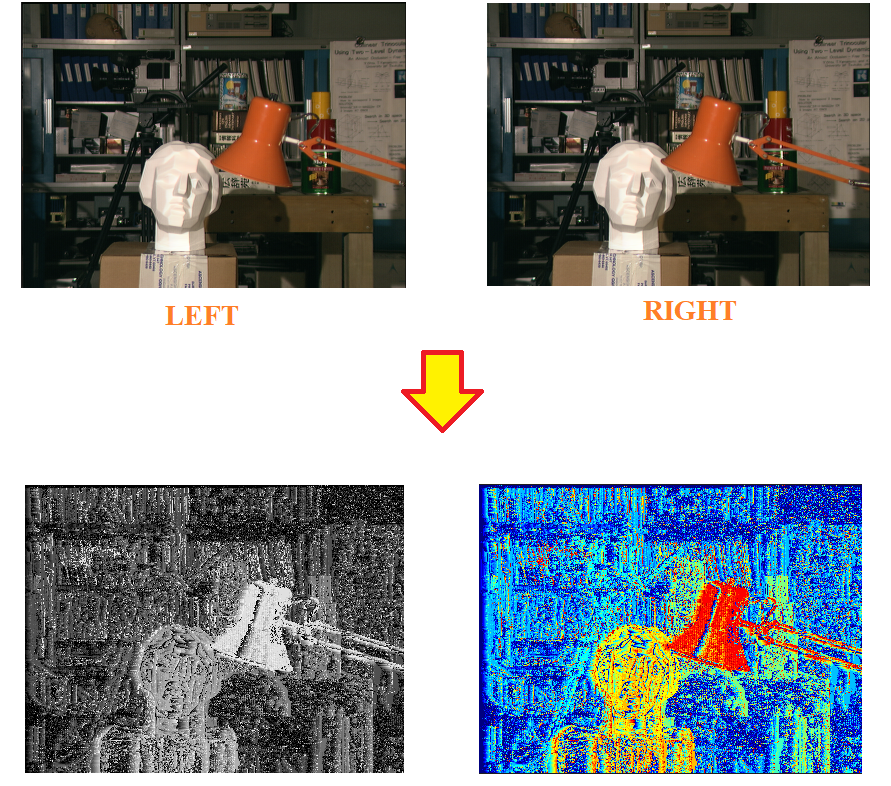
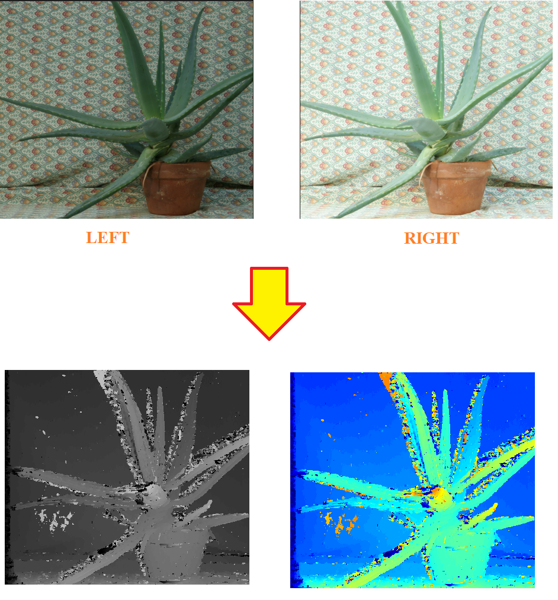

# Depth Image Estimation Project

This project implements various techniques for depth image estimation using stereo vision. It provides a comprehensive suite of algorithms for comparing stereo image pairs and generating depth maps.

## Table of Contents
- [Overview](#overview)
- [Features](#features)
- [Requirements](#requirements)
- [Installation](#installation)
- [Usage](#usage)
- [Implemented Methods](#implemented-methods)
- [Dataset](#dataset)
- [License](#license)

## Overview

Depth image estimation is a crucial task in computer vision, with applications in robotics, autonomous driving, and 3D reconstruction. This project offers a collection of algorithms to estimate depth from stereo image pairs using various similarity measures and matching techniques.

## Features

- Multiple similarity measures for depth estimation:
  - Absolute Difference (L1 Distance)
  - Mean Square Difference (L2 Distance)
  - Cosine Similarity
- Different matching techniques:
  - Pixel-wise matching
  - Window-based matching
- Support for different datasets (Tsukuba and Aloe)
- Visualization of depth maps using matplotlib and OpenCV

## Requirements

- Python 3.x
- OpenCV (cv2)
- NumPy
- Matplotlib

## Installation

1. Clone this repository:
   ```
   git clone https://github.com/yourusername/depth-image-estimation.git
   cd depth-image-estimation
   ```

2. Install the required packages:
   ```
   pip install opencv-python numpy matplotlib
   ```

3. Download the datasets:
   ```
   # For Tsukuba dataset
   gdown --id 14gf8bcym_lTcvjZQmg8kwq3aXkENBxMQ
   unzip tsukuba.zip -d tsukuba

   # For Aloe dataset
   gdown --id 1wxmiUdqMciuTOs0ouKEISl8-iTVXdOWn
   unzip Aloe_images.zip
   ```

## Usage

The project is structured into several Jupyter notebooks, each focusing on different aspects of depth estimation:

1. `Pixel_Wise_Matching.ipynb`: Implements pixel-wise matching using L1 and L2 distances.
2. `Window_Based_Matching_L1_L2.ipynb`: Implements window-based matching using L1 and L2 distances.
3. `Window_Based_Matching_Cosine.ipynb`: Implements window-based matching using cosine similarity.

To run a notebook:

```
jupyter notebook Pixel_Wise_Matching.ipynb
```

Follow the instructions within each notebook to execute the algorithms and visualize results.

## Implemented Methods

1. **Pixel-wise Matching**
   - L1 Distance
   - L2 Distance

2. **Window-based Matching**
   - L1 Distance
   - L2 Distance
   - Cosine Similarity

Each method is implemented in separate functions, allowing for easy comparison and experimentation.

## Dataset

The project supports two datasets:

1. **Tsukuba Dataset**: A classic stereo vision dataset featuring indoor scenes.
2. **Aloe Dataset**: Part of the Middlebury stereo dataset, featuring plant scenes with varying illumination.

To use a different dataset, modify the file paths in the respective notebooks.

## Screenshots
<div align="center">
   
   
</div>